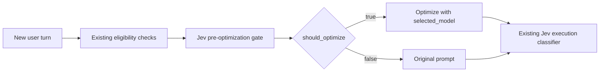

# Jev pre-optimization gate

`jev.py` decides whether prompt optimization is useful and selects the model that
performs it. The implementation uses local rules and the Python standard library;
it makes no LLM evaluation call. `JevConfig`, `Conditions`, `ModelConfig`, `Policy`,
`RoutingRule`, and `JevDecision` are dataclasses. `JevConfig.from_dict()` validates
JSON configuration and raises `ValueError` for unsupported fields or values.
`JevEvaluator` accepts either the JSON dictionary or a `JevConfig` instance.

The selected optimizer model is independent of the downstream execution model.
The existing remote Jev classifier still selects the execution tier and reasoning
effort after optimization. Its existing `settings.json.jev` configuration remains
separate from the new `settings.json.pre_optimization` object.

## Flow and integration



`preprocess_prompt(prompt, metadata=None, force=False)` in `jev_router.py` is the
shared integration point. It returns `(text, success, status, latency_ms, decision)`.
It is used by live new-turn processing, `/api/test-optimizer`, and
`/api/test-pipeline`. The two test APIs include `jev_pre_optimization` in their JSON
responses; live processing adds it to routing metadata and the existing JSONL log.
The SQLite schema and dashboard UI do not add new fields.

The existing optimizer master switch and human-input checks run first. Requests
that fail those checks return a skip decision without evaluating the rules.
`force_optimize` on the test APIs bypasses only the existing input heuristics;
it still respects the master switch, Jev decision, and budgets. Continuations reuse
the current execution model without re-optimizing. Existing escalation and
passthrough paths retain their behavior.

## Configuration

Use [jev.example.json](../jev.example.json) as the annotated example. It is valid
JSON: `_comment` keys supply explanations and are ignored by validation. Copy its
object into `settings.json` under `pre_optimization` and restart, or apply it with
the existing settings API:

```powershell
$gate = Get-Content .\jev.example.json -Raw | ConvertFrom-Json
$body = @{ pre_optimization = $gate } | ConvertTo-Json -Depth 12
Invoke-RestMethod http://127.0.0.1:8787/api/settings -Method Post -ContentType application/json -Body $body
```

Replace example model IDs and estimates for your provider before enabling it.
All models use the existing `optimizer.url`, credentials, system prompt, output
limit, and HTTP timeout. A model entry is an allowlist entry, not an availability
probe. An unavailable model causes the existing optimizer failure path to retain
the original prompt.

| Parameter | Meaning and default when omitted |
| --- | --- |
| `enabled` | Strict boolean; default `false` preserves existing installations. |
| `timeout_ms` | Positive evaluation deadline, default `50` ms. Checked between rule/keyword operations and before accepting the result. It is cooperative, not a hard process interruption. Config parsing occurs before this deadline. |
| `latency_budget_ms` | Optional maximum estimated optimizer-call latency; default `null` means no configured cap. |
| `cost_budget_usd` | Optional maximum estimated total cost per optimizer call; default `null` means no configured cap. |
| `disabled` | Policy used when `enabled=false`. Default: optimize with the current optimizer model if listed, otherwise the first listed model. |
| `fallback` | Policy used on evaluation error, timeout, or invalid decision. Default: skip. |
| Policy `should_optimize` | Required boolean. `false` always skips. `true` still requires the policy model to fit budgets. |
| Policy `selected_model` | Required configured model ID, including for a skip policy; a skip result always emits `null`. |
| `criteria` | AND of all supplied conditions. If omitted, defaults to `min_chars: 80`; `{}` allows any eligible prompt. |
| Condition `min_chars` | Inclusive non-negative integer minimum character count; default `0`. |
| Condition `min_tokens` | Inclusive non-negative integer minimum token count; default `0`. |
| Condition `min_complexity` | Inclusive non-negative integer minimum complexity score; default `0`. |
| Condition `categories` | Exact task-category allowlist; default `[]` allows all. Missing metadata fails a nonempty allowlist. |
| Condition `user_tiers` | Exact user-tier allowlist; default `[]` allows all. Missing metadata fails a nonempty allowlist. |
| `complexity_keywords` | Distinct case-insensitive substring matches each add one to complexity. Defaults: `refactor`, `architecture`, `database`, `concurrency`. This is a heuristic, not a semantic difficulty estimate. |
| `models` | Nonempty map of allowed IDs to estimates. If omitted, includes only the current optimizer model with unknown estimates. |
| Model `estimated_latency_ms` | Non-negative estimated optimizer latency; omitted/`null` is unknown. |
| Model `estimated_cost_usd` | Non-negative estimated total optimizer cost; omitted/`null` is unknown. |
| `routing_rules` | Ordered list; first matching affordable model wins. If omitted, one catch-all targets the default policy model. `[]` skips all enabled evaluations. |
| Rule `model` | Required configured model ID. |
| Rule `when` | Same AND conditions as `criteria`; default `{}` always matches. |

All numeric values must be finite; booleans are not accepted as numbers. Unknown
configuration fields are rejected. Disabled/error policy models and rule targets
must exist in `models`. Invalid settings updates are rejected before changing
runtime settings. Invalid gate configuration loaded from disk makes evaluation
skip safely. Settings saves from older dashboard clients preserve this section
when they omit it. An absent section or `{}` uses the existing optimizer model
and behavior; it does not activate the gate.

## Request metadata and budgets

The evaluator and both test APIs accept a context dictionary. Live requests pass
the request body's `metadata` dictionary to the evaluator. Supported values:

```json
{
  "tokens": 100,
  "category": "code",
  "user_tier": "pro",
  "latency_budget_ms": 800,
  "cost_budget_usd": 0.015
}
```

Numeric fields must be JSON numbers. Other metadata keys are ignored by the gate.
Live processing uses the existing extracted prompt, capped at 3,500 characters;
direct evaluator calls and test API calls use their full supplied prompt.
Missing `tokens` is estimated as `ceil(character_count / 3.8)`, minimum 1.
Category and tier are caller-supplied strings; this is routing context, not an
authorization mechanism. This change does not translate or remove request metadata
before forwarding it; callers must also satisfy their upstream's metadata schema.

The tighter of configured and request budgets wins. A zero budget is meaningful.
An unknown model estimate cannot satisfy a supplied budget. If a preferred model
exceeds a budget, later rules are considered; if none fit, optimization is skipped.
Budget checks also apply to disabled and error policies. Invalid request budgets
are treated as zero during fallback, preventing a paid fallback on invalid input.

These are admission checks using configured estimates, not billing enforcement or
an end-to-end latency guarantee. They cover only the optimizer call, excluding
gate time and downstream classification/execution. The existing
`optimizer.timeout_seconds` bounds optimizer HTTP operations separately.

## Failure behavior and output

Evaluation exceptions, deadline expiry, or malformed internal decisions use the
configured fallback. Invalid configuration always skips because its fallback
cannot be trusted. Decision reasons include exception types, not exception text
or prompt contents. Optimizer errors or invalid output retain the original prompt
through the existing optimizer fallback and placeholder checks.

```json
{
  "should_optimize": true,
  "selected_model": "gpt-6-sol",
  "reasoning": "Routing rule 1 matched within estimated budgets",
  "metadata": {
    "chars": 78,
    "tokens": 100,
    "complexity": 3,
    "category": "code",
    "user_tier": "pro",
    "evaluation_ms": 0.1
  }
}
```

`selected_model` is the canonical output name for the requested target model.
Skip results set it to `null`. Metadata contains evaluated facts and elapsed time;
fallback results additionally set `fallback: true`. Latency values vary per run.

## Runnable examples

Run `python examples/jev_scenarios.py`; it loads the example config and makes no
network calls.

1. **Simple:** `What is 2 + 2?` is shorter than `min_chars: 40`, so it returns
   `should_optimize: false`, `selected_model: null`. There is no optimizer call.
2. **Specialist:** `Refactor the database transaction handler and explain concurrency constraints.`
   meets the length threshold and matches three complexity keywords. The first
   rule requires two, so it selects `gpt-6-sol` within the example budgets.

For direct Python integration:

```python
from jev import JevEvaluator

decision = JevEvaluator(config, default_model="gemini-3.8-flash-high").evaluate(
    prompt, {"category": "code", "user_tier": "pro"}
)
if decision.should_optimize:
    result = optimize(prompt, model=decision.selected_model)
else:
    result = prompt
```
